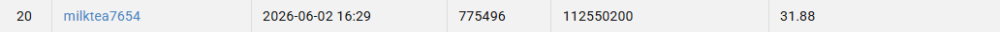

# NYCU Computer Vision 2026 HW4

- **Student ID:** 112550200
- **Name:** Zheng Wu Qian

## Introduction

This repository contains my implementation for NYCU Computer Vision 2026 HW4:
image restoration for rain and snow degradation.

The assignment requires a single PromptIR-based model that restores both rain
and snow images. No external data or pretrained weights are used. The final
model is a PromptIR-NAF-MSFN restoration network:

- PromptIR-style feature-aware prompt routing for all-in-one degradation
  conditioning.
- NAF-style encoder-decoder restoration backbone for efficient low-level image
  reconstruction.
- MSFN adapters at latent, decoder, and refinement stages for mixed-scale
  rain/snow feature modeling.
- Residual image prediction: the network predicts a correction and adds it to
  the degraded input image.

The final model and config files are intentionally kept compact:

```text
model/best.py
configs/best.yaml
configs/dataset.yaml
configs/train.yaml
configs/inference.yaml
```

## Environment Setup

Python 3.9 or later is recommended. Install the required packages with:

```bash
pip install -r requirements.txt
```

Main dependencies:

```text
torch
torchvision
numpy
Pillow
tqdm
PyYAML
tensorboard
```

Dataset layout expected by the code:

```text
data/
  train/
    degraded/
      rain-1.png
      ...
      snow-1600.png
    clean/
      rain_clean-1.png
      ...
      snow_clean-1600.png
  degraded/
    0.png
    ...
    99.png
```

## Usage

### Training

Train the final model from scratch:

```bash
python train.py --config configs/train.yaml
```

Training outputs are saved under a timestamp-only directory:

```text
output/YYYYMMDD_HHMMSS/
  checkpoints/
    best.pt
    last.pt
  logs/
  visuals/
  config_resolved.yaml
```

The default training config uses:

```text
epochs: 420
batch_size: 8
crop_size: 128
EMA decay: 0.999
model parameters: approximately 58.72M
```

### Inference

Generate the final CodaBench submission:

```bash
python inference.py --config configs/inference.yaml
```

The default inference config uses:

```text
checkpoint: output/20260601_224150_github_msfn_custom/checkpoints/best.pt
TTA: 2-way gravity-aware horizontal flip
tile: 128
overlap: 32
```

It writes:

```text
output/Best_pred.npz
output/Best_pred.zip
```

The zip file contains `pred.npz` at the root, as required by the submission
format.

To use another checkpoint:

```bash
python inference.py \
  --config configs/inference.yaml \
  --checkpoint output/YYYYMMDD_HHMMSS/checkpoints/best.pt
```

To use another dataset path:

```bash
python inference.py \
  --config configs/inference.yaml \
  --data_root /path/to/hw4/data
```

## Performance Snapshot

